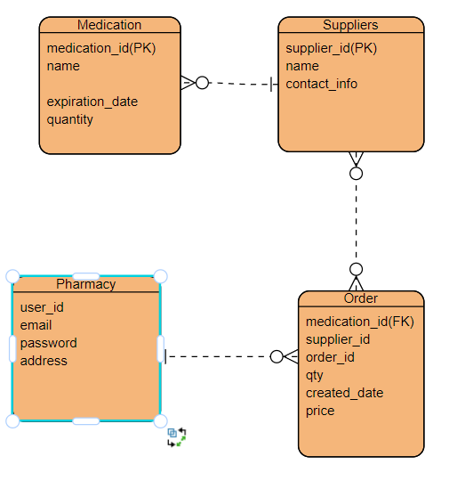
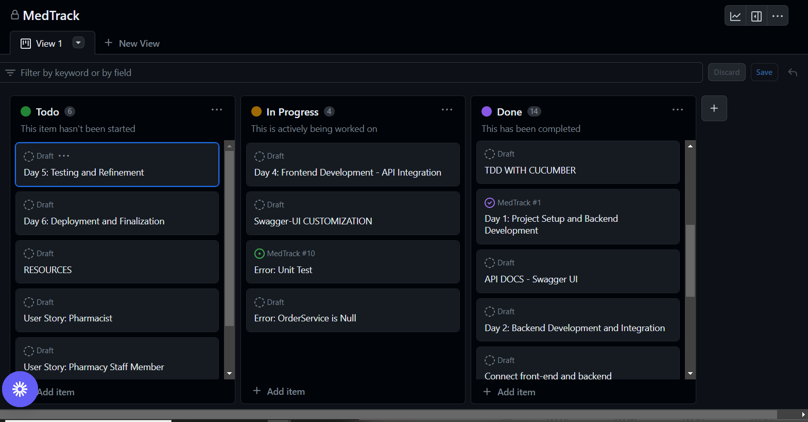
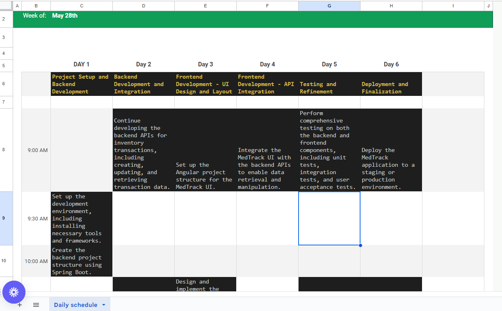
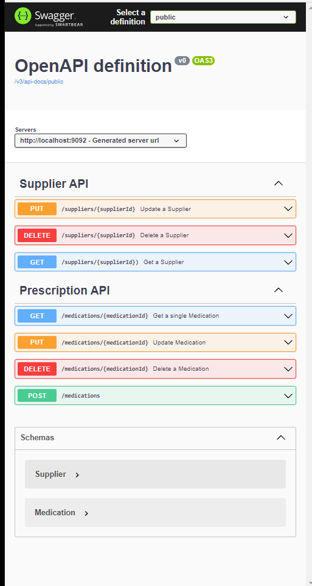
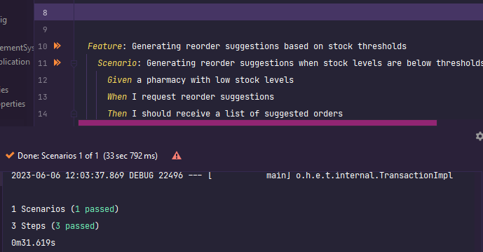

# MedTrack


## Table of Contents
- [Description](#description)
- [Key Features](#key-features)
- [MedTrack UI](#medtrack-ui)
- [MedTrack API](#medtrack-api)
- [Repo's](#repos)
- [Schedule](#schedule)
- [PitchDeck](#pitchdeck)
- [User Stories](#user-stories)
- [Planning Documentation](#planning-documentation)
    - [ERD Diagram](#erd-diagram)
    - [External Links to Planning Documents](#external-links-to-planning-documents)
    - [Unsolved Problems and Hurdles Tackled](#unsolved-problems-and-hurdles-tackled)
    - [Major Wins](#major-wins)
- [Test Driven Development (TDD)](#test-driven-development-tdd)
- [Tools and Technologies](#tools-and-technologies)
- [Installation Instructions For Dependencies](#installation-instructions-for-dependencies)
- [How To Install and Run this Application on your own Machine](#how-to-install-and-run-this-application-on-your-own-machine)
- [Credits](#credits)
- [References](#references)

## Description
MedTrack is a cutting-edge Pharmacy Inventory Management solution that optimizes stock management for pharmacies. With real-time inventory tracking, automated reordering, expiration date alerts, and advanced analytics, MedTrack empowers pharmacies to proactively manage inventory and deliver exceptional customer service.

It revolutionizes the way pharmacies handle their inventory, ensuring medication availability, reducing waste, and enhancing operational efficiency. With MedTrack, pharmacies can take control of their inventory, streamline operations, and make informed decisions for optimized supply chain management.

Elevate your pharmacy's inventory management capabilities with MedTrack and unlock the full potential of your operations.


## Key Features
1. Product Management: Allow pharmacists or administrators to add, update, and remove products from the inventory. Each product entry can include details like name, description, quantity, expiration date, and supplier information.


2. Stock Tracking: Keep track of the quantity and availability of each product in real-time. The system can automatically update the stock levels when products are added or sold.


3. Notifications and Alerts: Send notifications or alerts to administrators when stock levels are running low or when products are approaching their expiration dates. This helps in ensuring timely replenishment and minimizing waste.


4. Reporting and Analytics: Generate reports and analytics to provide insights into inventory trends, popular products, and reordering patterns. This can assist in optimizing inventory management strategies and improving decision-making.


5. Barcode Scanning: Integrate barcode scanning functionality to quickly add products to the inventory or update their quantities during stock management processes.


## MedTrack UI
The MedTrack UI is the user interface component of the MedTrack Pharmacy Inventory Management system. It provides a visually appealing and intuitive interface for users to interact with the system's features and functionalities. With its user-friendly design, the MedTrack UI ensures a seamless and efficient user experience, empowering pharmacies to effectively manage their inventory and streamline their operations.

 [Front-End Repo:](https://github.com/builde7b0b/MedTrack-UI)


## MedTrack API
The MedTrack API serves as the backend RESTful API for the MedTrack Pharmacy Inventory Management system. It handles the business logic and data processing related to inventory management, providing secure and efficient communication between the front-end user interface and the underlying database. The MedTrack API enables seamless integration with other components and external systems, ensuring reliable and robust functionality for managing medication inventory in pharmacies.


### User Stories
- Manager (Bronze MVP)

As a pharmacy manager, I want to track the inventory levels of medications in real-time, so I can ensure that we always have an adequate stock to meet customer demand.

As a pharmacy manager, I want the inventory management system to generate automated reorder suggestions based on predefined stock thresholds, so that we can ensure timely restocking and avoid stockouts.

- Pharmacist

As a pharmacist, I want the inventory management system to integrate with our point-of-sale (POS) system, so that medication sales are automatically deducted from inventory, reducing the chances of errors and ensuring accurate stock levels.

As a pharmacist, I want the system to provide analytics and insights on medication expiration trends, so that I can take preventive measures to minimize waste and improve inventory turnover.

As a pharmacist, I want to receive automated alerts when medications are running low or approaching their expiration dates, so I can take proactive measures to restock or remove expired items from inventory.

- Staff Member
  
(Bronze MVP) As a pharmacy staff member, I want to easily generate reports on medication usage, demand patterns, and stock availability, so I can make data-driven decisions regarding inventory management and ordering.

As a pharmacy staff member, I want the ability to search and locate specific medications within the pharmacy, with the help of a barcode scanning feature or location information, to improve efficiency and reduce search time.

- Purchaser

As a pharmacy purchaser, I want to streamline the procurement process by electronically submitting orders to suppliers, receiving order confirmations, and automating invoice reconciliation, to reduce manual paperwork and administrative tasks.

- Owner

As a pharmacy owner, I want to analyze historical sales data and inventory trends, so I can identify opportunities to optimize inventory levels, reduce carrying costs, and improve profitability.

- Technician (Bronze MVP)

As a pharmacy technician, I want to have a user-friendly interface to easily update inventory records when new stock arrives, record returns or recalls, and manage stock transfers between different pharmacy locations.

### Planning Documentation


#### ERD Diagram


#### Kanban 


#### Schedule


#### Schedule Link
[MedTrack Sprint Schedule](https://docs.google.com/spreadsheets/d/1THddOjoQ_yJ1i91F8wUDcJqcaAzPcLBNjWlf-xtPhfY/edit?usp=sharing)


#### PitchDeck:
[MedTrack Introduction](https://docs.google.com/presentation/d/1u8qFr95GXvOkukSt1QMjLdhYJfj3I9AmcHjIXdeYIIQ/edit?usp=sharing)


#### Unsolved Problems and Hurdles Tackled

- Managing Stress/Timeline
- Database Issues
- Configuration errors

#### Major Wins
- Creating a full stack application in 6 days
- implementing complex functionality
- maintaining front-end and backend connectivity and dynamic data rendering
- setting up docker and stretching my skillset
- 

## Test Driven Development (TDD)

This project follows the Test Driven Development (TDD) approach to ensure the reliability and correctness of the codebase. TDD involves writing tests before implementing the actual code logic.

Here's an overview of the TDD process followed in this project:
- 
1. **Write Tests**: Tests are written in the form of Cucumber feature files using Gherkin syntax. Each feature file describes a specific functionality or scenario to be tested. Test scenarios are written in a user-friendly language that captures the expected behavior of the system.

2. **Run Tests**: The Cucumber tests are executed using the TestRunner and Test Definitions. These files contain the necessary configurations and definitions for running the tests. Tests can be run locally or integrated with a CI/CD system for automated testing on each code commit.

3. **Implement Code**: After writing the tests, the corresponding code implementation is done to make the tests pass. The implementation follows the principles of SOLID design and clean code practices. The tests act as a guide to ensure that the code meets the desired functionality.

4. **Refactor Code**: Once the tests pass, the code is refactored to improve its design, readability, and maintainability. Refactoring involves making changes to the code without altering its behavior. The goal is to enhance the code's structure, eliminate duplication, and improve overall code quality.

5. **Re-run Tests**: After refactoring the code, the tests are re-run to ensure that the changes have not introduced any regressions or unexpected behavior. This step verifies that the code still adheres to the desired functionality defined by the tests.


### Tools and Technologies
- Java
- Spring Boot
- Spring MVC
- Spring Security
- Spring Data JPA
- Hibernate
- Git
- Junit
- Maven
- IntelliJ IDEA


### Installation Instructions For Dependencies

1. Open your project in an IDE or navigate to the project directory using the command line.
2. Locate the pom.xml file in the root directory of your project.
3. Open the pom.xml file and locate the <dependencies> section.
4. Copy the dependency block for each dependency mentioned above and paste it inside the <dependencies> section of your pom.xml file.
5. Save the pom.xml file.
6. Build the project to resolve and download the dependencies by running one of the following commands:

- If you are using an IDE like Eclipse or IntelliJ IDEA, you can use the IDE's build or compile command to resolve the dependencies.
- If you are using the command line, navigate to the project directory and run the command mvn clean install. This will trigger the Maven build process and download the dependencies specified in the pom.xml file.
7. Wait for the build process to complete. Maven will download the required dependencies from the Maven Central Repository or other specified repositories.
8. Once the build process is successful, the dependencies should be installed and available for your project to use.

    - Note: If you are using an IDE, it might automatically download the dependencies and update the project configuration. If not, you can manually refresh the project or restart the IDE to ensure that the dependencies are recognized.

### How To Install and Run this Application on your own Machine

To run this application on your local machine, please follow the steps below:

1. Prerequisites

Before proceeding with the installation, ensure that the following prerequisites are met:

- Java Development Kit (JDK) 8 or higher is installed on your machine.
- Apache Maven is installed.
- PostgreSQL database is installed and running.

2. Clone the Repository

Clone the project repository from the GitHub repository using the following command:
```
git clone <repository-url>
```

3. Configure the Database

Open the application.properties file located in the src/main/resources directory.
Update the database configuration properties according to your PostgreSQL database setup.
Make sure to provide the correct database URL, username, and password.


4. Build the Application

Navigate to the project's root directory and build the application using Maven. Run the following command:
```
mvn clean install
```

5. Run the Application

After a successful build, run the application using the following command:
```
mvn spring-boot:run
```
The application will start, and you will see the logs indicating the server is up and running.


6. Access the Application

Open your web browser and access the application using the following URL:
```
http://localhost:8080
```
You can now explore and interact with the application.


## Credits

My Instructors:
- Leo Rodriguez - [LinkedIn](https://www.linkedin.com/in/leonardo-rodriguez/)
- [Suresh Sigera](https://github.com/sureshmelvinsigera)
- Dhrubo Chowdhury [LinkedIn](https://www.linkedin.com/in/dhrubo-hasan/)

Their dedication and expertise have greatly contributed to the success of this project. We are grateful for their valuable insights and efforts.


## References
[Security Feature Doc Strings](https://docs.spring.io/spring-security/site/docs/current/api/index.html)

[Add JWT to Header for use with RestTemplate](https://stackoverflow.com/questions/20186497/what-is-the-resttemplate-exchange-method-for...and)

[Git Stashing](https://www.gitkraken.com/learn/git/git-stash#:~:text=Git%20Stash%20List&text=The%20Git%20stash%20list%20command,stash%40%20and%20the%20desired%20index)

[Git Merging - Source: Atlassian](https://www.atlassian.com/git/tutorials/using-branches/git-merge)

[Git Branching - Source: git-scm.com](https://git-scm.com/book/en/v2/Git-Branching-Basic-Branching-and-Merging)

[Rest Assured - Source: github.com](https://github.com/rest-assured/rest-assured/wiki/GettingStarted)

[For ERD  - dbdiagram.com](https://dbdiagram.io/)

[HTTP Status Codes - Source: Mozilla.org](https://developer.mozilla.org/en-US/docs/Web/HTTP/Status)

[Cucumber School - Source: Cucumber.io](https://school.cucumber.io/courses/take/bdd-with-cucumber-java/lessons/9588457-add-a-scenario-wire-it-up)

[Gherkin Syntax - Cucumber.io](https://cucumber.io/docs/gherkin/)

[JSON Jwt Tokens - JWT.io](https://jwt.io)
